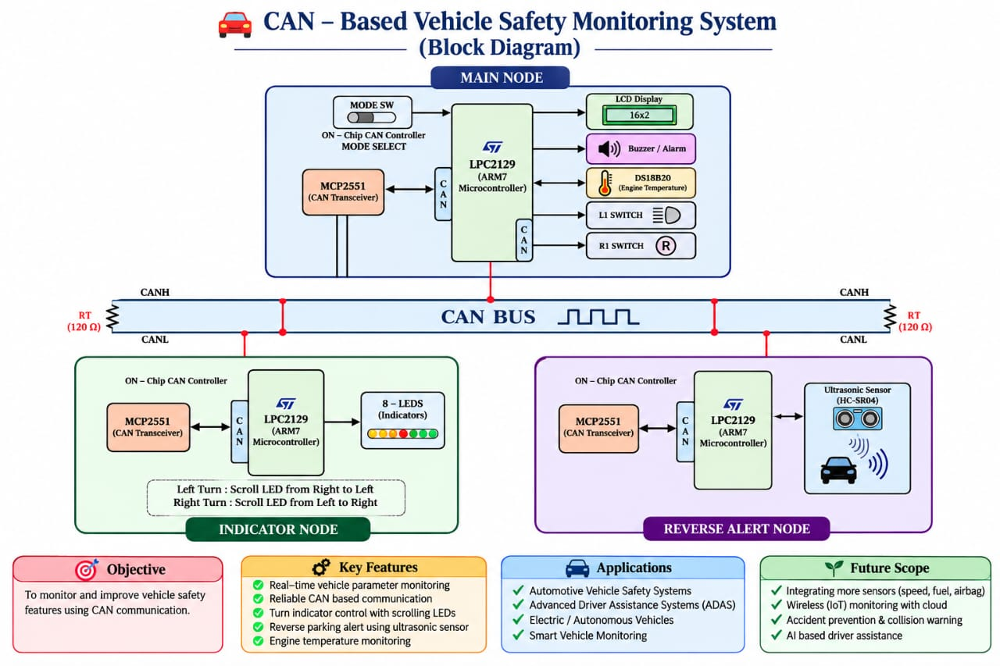

# 🚗 CAN-Based Vehicle Safety & Monitoring System

An automotive safety and monitoring system built on the **Controller Area Network (CAN)** protocol. A central **Main Node** monitors engine temperature, controls vehicle indicators, and processes reverse sensor data to deliver real-time safety alerts through coordinated communication with multiple CAN nodes.

## 📋 Overview

The system consists of three microcontroller nodes communicating over CAN:

- **Main Node** — Reads engine temperature continuously, handles indicator switch interrupts, manages forward/reverse mode switching, and triggers reverse-alert warnings.
- **Indicator Node** — Listens for CAN messages from the Main Node and drives the vehicle's LED turn indicators accordingly.
- **Reverse Alert Node** — Reads distance data from an ultrasonic sensor and reports proximity status to the Main Node over CAN.

## ✨ Features

- Real-time engine temperature monitoring (DS18B20) displayed on LCD
- Indicator (turn signal) control via external switch interrupts
- Forward / Reverse mode switching via a dedicated mode switch
- Reverse parking assist using ultrasonic distance sensing (HC-SR05)
- Buzzer/LED alert when an obstacle is detected in reverse mode
- Multi-node communication using the CAN protocol

## 🗺️ System Architecture

The system uses three LPC2129 nodes connected on a shared CAN bus (CANH/CANL with termination resistors at each end).

- **Main Node** — LPC2129 + MCP2551, interfaced with LCD, Buzzer/LED, DS18B20 (engine temp), Mode Switch, and Left/Right indicator switches (via external interrupts).
- **Indicator Node** — LPC2129 + MCP2551, driving 8 LEDs that scroll left-to-right or right-to-left based on the indication received.
- **Reverse Alert Node** — LPC2129 + MCP2551, interfaced with an HC-SR05 ultrasonic sensor for obstacle distance sensing.

## 🔧 Hardware Requirements

| Component | Purpose |
|---|---|
| LPC2129 (x3) | Microcontroller for each node |
| CAN Transceiver (MCP2551) | CAN bus physical layer interface |
| LEDs | Indicator signals / alerts |
| LCD | Status and sensor value display |
| Ultrasonic Sensor (HC-SR05) | Reverse distance sensing |
| Switches | Indicator control and mode selection |
| DS18B20 Temperature Sensor | Engine temperature sensing |
| USB to UART Converter | Programming/debugging interface |

## 💻 Software Requirements

- Embedded C
- Keil µVision (C Compiler/IDE)
- Flash Magic (for flashing LPC2129)

## 🧠 Prerequisites / Knowledge Required

- Embedded C programming
- LPC2129 architecture: GPIO, ADC, Interrupts, CAN interface
- Understanding of the CAN protocol

## ⚙️ How It Works

### 🅰️ Main Node
Continuously reads engine temperature via DS18B20 and displays it on the LCD. External interrupts (SW1/SW2) trigger indicator control signals sent to the Indicator Node over CAN. A mode switch toggles between **forward mode** (default) and **reverse mode**. In reverse mode, the Main Node listens for data from the Reverse Alert Node and activates a buzzer/LED when an obstacle is detected.

### 🅱️ Indicator Node
Waits for CAN messages from the Main Node and drives the corresponding LED indicator signals.

### 🅲️ Reverse Alert Node
Continuously reads the HC-SR05 ultrasonic sensor. If the measured distance falls below a defined threshold, it sends logic `1` to the Main Node over CAN (obstacle detected); otherwise it sends logic `0`.

## 🪜 Implementation Sequence

1. Set up the project folder/workspace.
2. Test each module individually before integration:
   - LCD: display character, string, and integer constants.
   - DS18B20: read engine temperature and display on LCD.
   - External interrupts: verify interrupt count is tracked and shown on LCD.
   - Ultrasonic sensor: read and display distance.
   - Basic CAN code: flash and verify communication on hardware.
3. Once all modules work independently, integrate them into the final code for each node (Main, Indicator, Reverse Alert).

## 🚀 Getting Started

1. Clone this repository.
2. Open each node's project in Keil µVision.
3. Build the project to generate the `.hex` file.
4. Flash the `.hex` file to the respective LPC2129 board using Flash Magic.
5. Connect all three nodes on the same CAN bus (via MCP2551 transceivers) and power them on.
6. Verify LCD output, indicator behavior, and reverse alert functionality as described above.

## 📄 License

Add your preferred license here (e.g., MIT).
