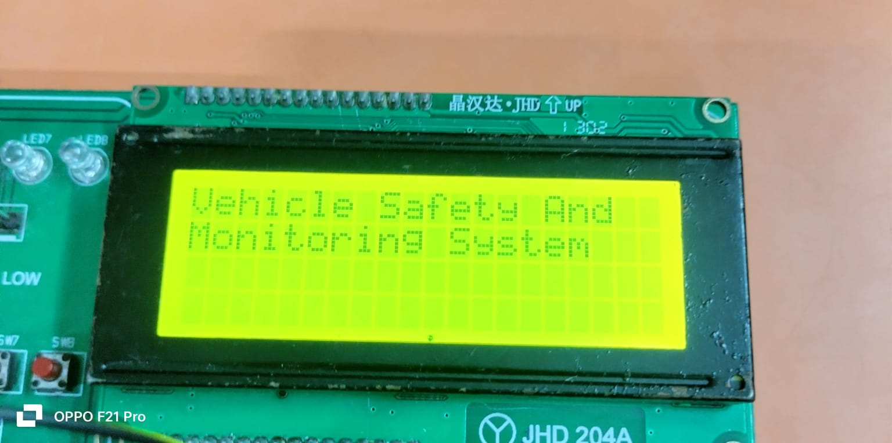
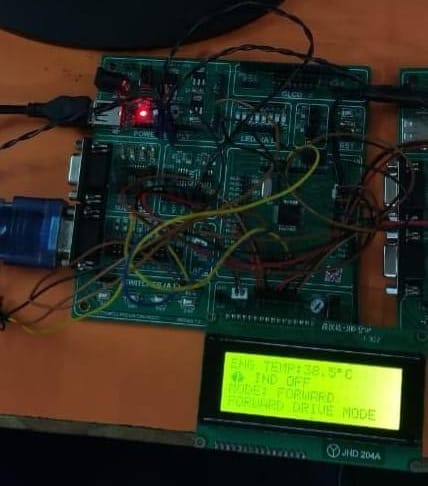
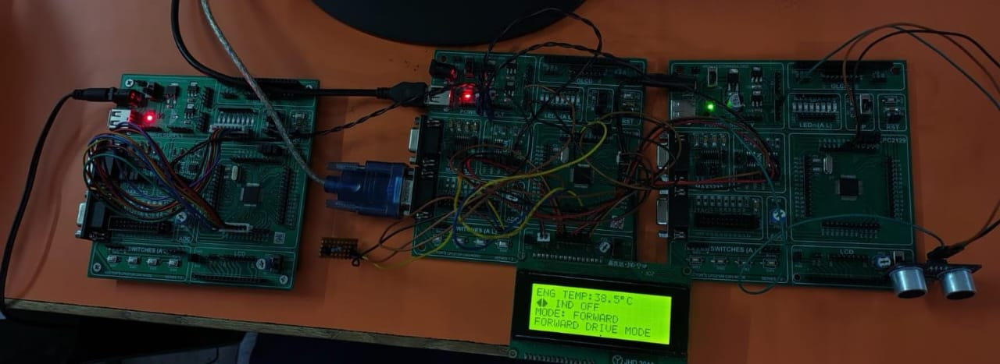
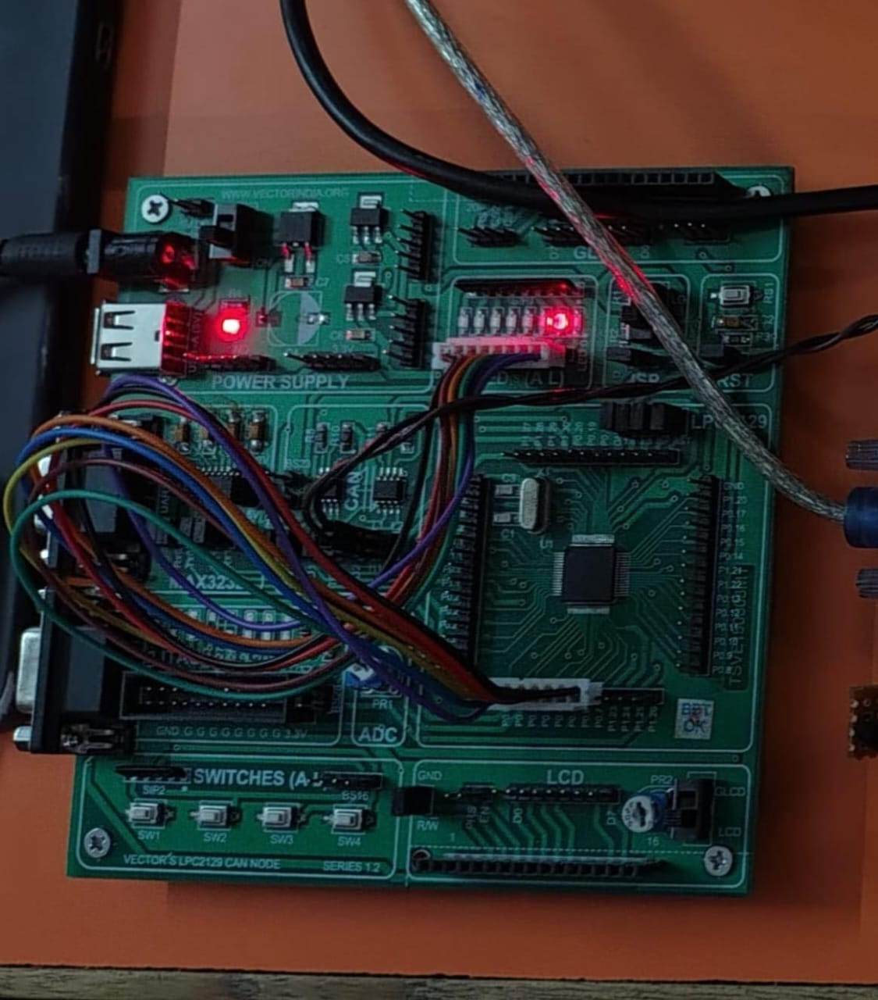
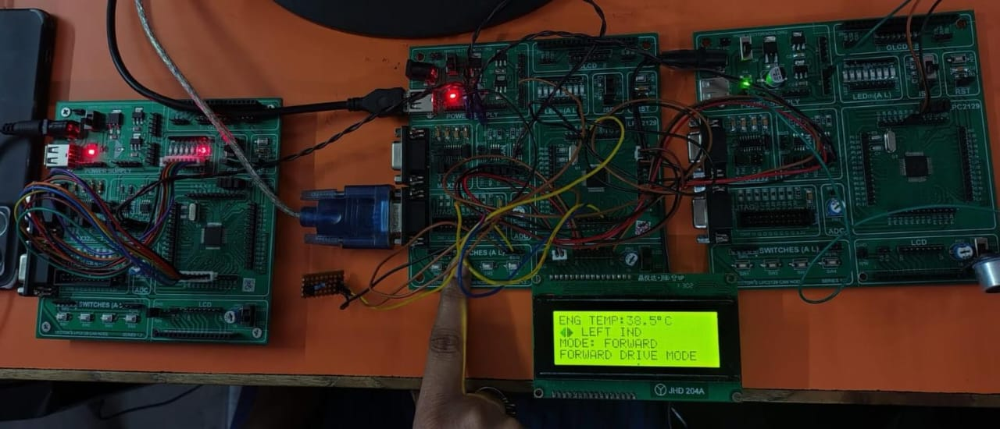
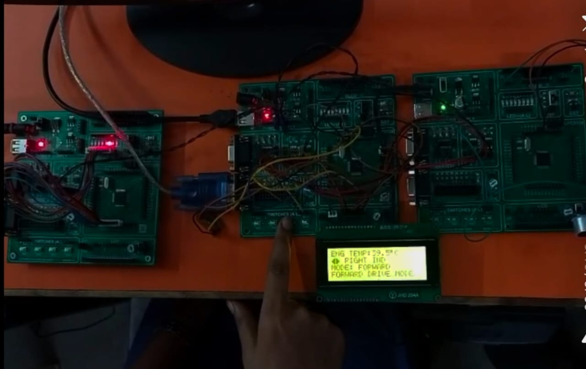
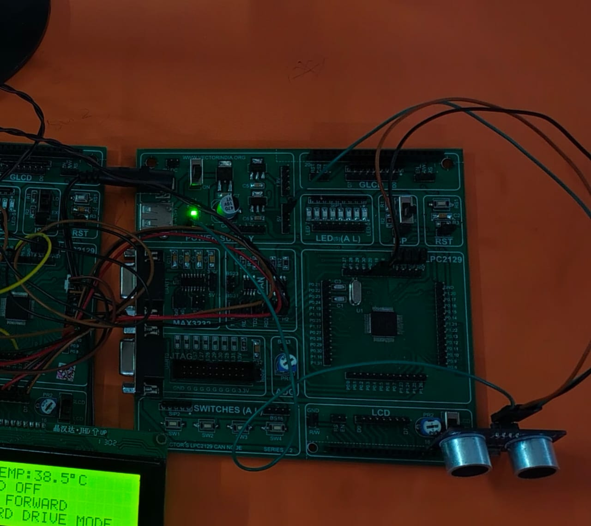

# 🚗 CAN-Based Vehicle Safety & Monitoring System

An automotive safety and monitoring system built on the **Controller Area Network (CAN)** protocol. A central **Main Node** monitors engine temperature, controls vehicle indicators, and processes reverse sensor data to deliver real-time safety alerts through coordinated communication with multiple CAN nodes.

## 📋 Overview

The system consists of three microcontroller nodes communicating over CAN:

- **Main Node** — Reads engine temperature continuously, handles indicator switch interrupts, manages forward/reverse mode switching, and triggers reverse-alert warnings.
- **Indicator Node** — Listens for CAN messages from the Main Node and drives the vehicle's LED turn indicators accordingly.
- **Reverse Alert Node** — Reads distance data from an ultrasonic sensor and reports proximity status to the Main Node over CAN.

### ⭐ Features

- 🌡️ Real-time engine temperature monitoring
- 📡 CAN-based multi-node communication
- 💡 Automatic indicator control
- 📏 Reverse obstacle detection
- 🚨 Safety alert generation
- 🔄 Forward/Reverse operating modes
- 📺 LCD-based information display
- ⚡ External interrupt handling

  
## 🗺️ System Architecture

The system uses three LPC2129 nodes connected on a shared CAN bus (CANH/CANL with termination resistors at each end).

- **Main Node** — LPC2129 + MCP2551, interfaced with LCD, Buzzer/LED, DS18B20 (engine temp), Mode Switch, and Left/Right indicator switches (via external interrupts).
- **Indicator Node** — LPC2129 + MCP2551, driving 8 LEDs that scroll left-to-right or right-to-left based on the indication received.
- **Reverse Alert Node** — LPC2129 + MCP2551, interfaced with an HC-SR05 ultrasonic sensor for obstacle distance sensing.

## 🔧 Hardware Requirements

| Component | Purpose |
|---|---|
| LPC2129 (x3) | Microcontroller for each node |
| CAN Transceiver (MCP2551) | CAN bus physical layer interface |
| LEDs | Indicator signals / alerts |
| LCD | Status and sensor value display |
| Ultrasonic Sensor (HC-SR05) | Reverse distance sensing |
| Switches | Indicator control and mode selection |
| DS18B20 Temperature Sensor | Engine temperature sensing |
| USB to UART Converter | Programming/debugging interface |

## 💻 Software Requirements

- Embedded C
- Keil µVision (C Compiler/IDE)
- Flash Magic (for flashing LPC2129)

## 🧠 Prerequisites / Knowledge Required

- Embedded C programming
- LPC2129 architecture: GPIO, ADC, Interrupts, CAN interface
- Understanding of the CAN protocol

### 🚀 Applications
This concept can be used in:
- 🚗 Automotive safety systems
- 🚌 Public transportation vehicles
- 🚛 Commercial vehicles
- 🚙 Reverse parking assistance
- 🏭 Industrial vehicle monitoring
- 🔧 Embedded automotive control systems

## ⚙️ How It Works
- After the turning on the power supply of hardware it directly displays the title .
  

### 🧠 NODE 1 — MAIN NODE
 🎯 Purpose  
  
. The Main Node is the central control node. It monitors engine temperature, handles switch inputs, controls the vehicle mode, sends indicator commands,    and receives reverse-alert information. 
 
 
. The Main Node Continuously reads the DS18B20 temperature sensor. 
. After obtaining the temperature ,the main node displays it on the LCD.  
    
. The Main Node monitors SW1/SW2/SW3 using external interrupts. 
. When the appropriate switch interrupt occurs, the Main Node generates an indicator control signal. 
. The Main Node also controls the operating mode. 
. Initially: 
  ➡️ Forward Mode. 
  When the mode switch is pressed: 
  ➡️ Forward Mode → 🔙 Reverse Mode 
  When pressed again: 
  🔙 Reverse Mode → ➡️ Forward Mode. 
. when the vehicle is in Reverse Mode, the Main Node starts processing information received from the Reverse Alert Node. 
. The Main Node checks the information received from the Reverse Alert Node. 
. A  mode switch toggles between **forward mode** (default) and **reverse mode**. In reverse mode, the Main Node listens for data from the Reverse Alert      Node and activates a buzzer/LED when an obstacle is detected.

### 💡 NODE 2 — INDICATOR NODE
 # 🎯 Purpose
. The Indicator Node is responsible for controlling the indicator signals/LEDs according to commands received from the Main Node. 
   
. The Indicator Node continuously waits for CAN data.  
. the indicator node initializes LPC2129,CAN interface,indicator LEDs. 
. The indicator node continuously waits for a CAN message from the Main Node. 
. The indicator Node checks the Received CAN information and determines which indicator output needs to be control. 
. The appropriate indiacator signal is activated. 
 

### 📡 NODE 3 — REVERSE ALERT NODE
 # 🎯 Purpose
- The Reverse Alert Node continuously monitors the HC-SR05 ultrasonic sensor and determines whether an obstacle is within the predefined distance limit.
- The Reverse Node initializes the lpc2129,ultrasonic sensor(HC-SR05).
- The project implementation sequence specifically includes testing the ultra-sonic sensor by reading the object distance and displaying it on the LCD.
  
. The measured distance is compared with a predifined limit. 
. The object is with in the alert range it gives  the logic one.The object is outside the limit it gives the logic zero. 
. The Reverse alert node sends the result through CAN. 
 
 

### 🔮 Future Scope
The system can be further enhanced by adding:
- 📱 Mobile application for vehicle monitoring
- 🌐 IoT-based remote monitoring
- 📍 GPS-based vehicle tracking
- 📷 Camera-based obstacle detection
- 🤖 AI-based accident prediction
- 📊 Cloud-based vehicle data logging
- 🔔 Advanced driver warning systems

### 📜 Conclusion
The CAN-Based Vehicle Safety & Monitoring System demonstrates how multiple embedded nodes can communicate using the CAN protocol to perform vehicle
monitoring and safety functions.
The system combines temperature monitoring, indicator control, reverse obstacle detection, interrupts, and CAN communication into an integrated automotive safety solution. 🚗💡📡
